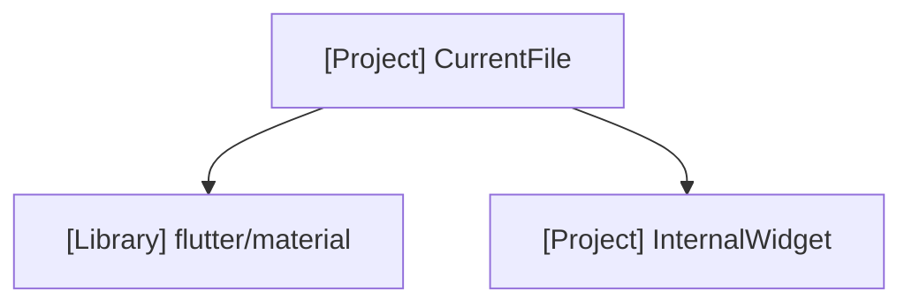

# AI Prompt: Generate Dependency Graphs

**Objective**: Create a comprehensive documentation folder `docs/dependencies/` that contains dependency graphs for every Dart file in the `lib/` directory.

**Instructions**:
1.  **Analyze**: Scan the `lib` folder recursively for all `.dart` files.
2.  **Map**: For each file found (e.g., `lib/path/to/file.dart`), you will create a corresponding markdown file in `docs/dependencies/` (e.g., `docs/dependencies/path/to/file_dependency.md`). Ensure the directory structure in `docs/dependencies` mirrors `lib/`.
3.  **Graph**: Inside each markdown file, generate a MermaidJS diagram representing the imports of that specific file.
    - **Node A**: The file itself (root node).
    - **Nodes B...N**: The files/packages it imports.
    - **Edges**: Directed arrows from the file to its imports.
    - **Classification**: Distinguish between **External Libraries** and **Internal Project Files**.
        - **External Library**: Imports starting with `dart:`, `package:flutter`, or other 3rd party packages.
        - **Internal Project**: Relative imports or imports from the app's own package.
    - **Labeling**:
        - Do NOT use colors/styles to distinguish types.
        - Instead, use a text prefix inside the node label.
        - **External Library**: Format node text as `[Library] <name>`.
        - **Internal Project**: Analyze file path to determine Clean Architecture type:
            - **[Entity]**: `domain/entities`, `models`
            - **[Domain]**: `domain` (other than entities)
            - **[Infrastructure]**: `infrastructure`, `data`, `repositories`, `dtos`
            - **[Application]**: `application`, `services`, `providers`, `usecases`
            - **[UI]**: `pages`, `widgets`, `presentation`, `views`
            - **[Theme]**: `theme`, `app_colors.dart`
            - **[Project]**: Fallback if type is unclear.
        - Format node text as `[<Type>] <name>`.

**Format Template**:
Files should follow this structure:

```markdown
# Dependency Graph: [Filename]

Location: `[Original File Path]`


```

**Scope**:
- Include all `package:` imports.
- Include all relative imports.
- Format node names to be readable (e.g., use the file name, strip full paths if too long, or use subgraphs).

**Action**:
Execute this plan immediately by creating the `docs/dependencies` folder and populating it with the generated markdown files.
