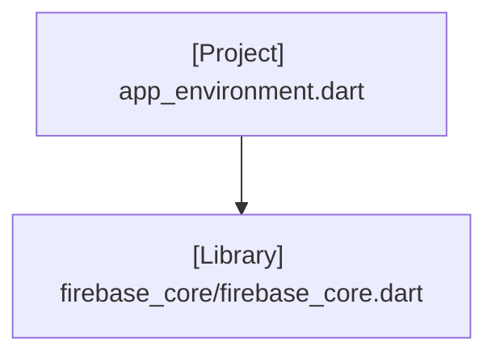

# Dependency Graph: app_environment.dart

Location: `lib/app/config/app_environment.dart`

```mermaid
graph TD
    app_environment_dart["[Project] app_environment.dart"]
    app_environment_dart --> firebase_core_firebase_core_dart["[Library] firebase_core/firebase_core.dart"]
```
