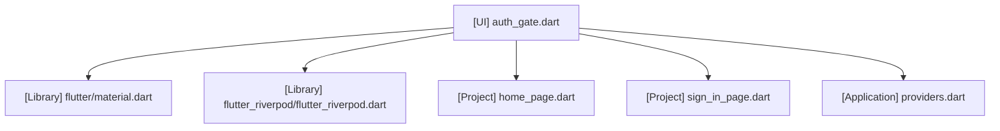

# Dependency Graph: auth_gate.dart

Location: `lib/app/pages/auth/auth_gate.dart`

```mermaid
graph TD
    auth_gate_dart["[UI] auth_gate.dart"]
    auth_gate_dart --> flutter_material_dart["[Library] flutter/material.dart"]
    auth_gate_dart --> flutter_riverpod_flutter_riverpod_dart["[Library] flutter_riverpod/flutter_riverpod.dart"]
    auth_gate_dart --> home_page_dart["[Project] home_page.dart"]
    auth_gate_dart --> sign_in_page_dart["[Project] sign_in_page.dart"]
    auth_gate_dart --> providers_dart["[Application] providers.dart"]
```
