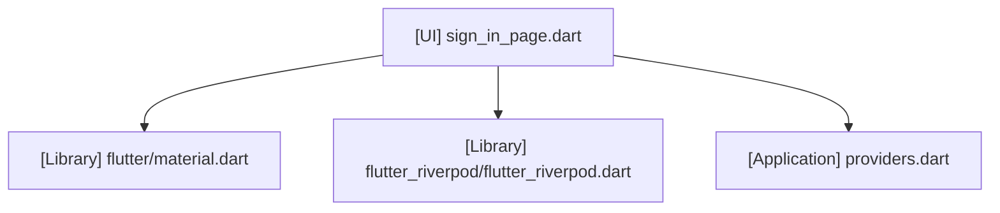

# Dependency Graph: sign_in_page.dart

Location: `lib/app/pages/auth/sign_in_page.dart`

```mermaid
graph TD
    sign_in_page_dart["[UI] sign_in_page.dart"]
    sign_in_page_dart --> flutter_material_dart["[Library] flutter/material.dart"]
    sign_in_page_dart --> flutter_riverpod_flutter_riverpod_dart["[Library] flutter_riverpod/flutter_riverpod.dart"]
    sign_in_page_dart --> providers_dart["[Application] providers.dart"]
```
