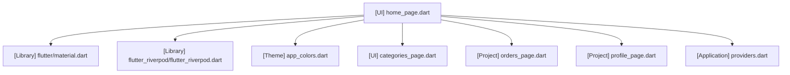

# Dependency Graph: home_page.dart

Location: `lib/app/pages/home_page/home_page.dart`

```mermaid
graph TD
    home_page_dart["[UI] home_page.dart"]
    home_page_dart --> flutter_material_dart["[Library] flutter/material.dart"]
    home_page_dart --> flutter_riverpod_flutter_riverpod_dart["[Library] flutter_riverpod/flutter_riverpod.dart"]
    home_page_dart --> app_colors_dart["[Theme] app_colors.dart"]
    home_page_dart --> categories_page_dart["[UI] categories_page.dart"]
    home_page_dart --> orders_page_dart["[Project] orders_page.dart"]
    home_page_dart --> profile_page_dart["[Project] profile_page.dart"]
    home_page_dart --> providers_dart["[Application] providers.dart"]
```
