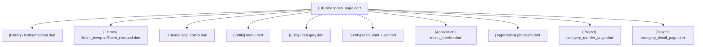

# Dependency Graph: categories_page.dart

Location: `lib/app/pages/home_page/widgets/categories_page.dart`

```mermaid
graph TD
    categories_page_dart["[UI] categories_page.dart"]
    categories_page_dart --> flutter_material_dart["[Library] flutter/material.dart"]
    categories_page_dart --> flutter_riverpod_flutter_riverpod_dart["[Library] flutter_riverpod/flutter_riverpod.dart"]
    categories_page_dart --> app_colors_dart["[Theme] app_colors.dart"]
    categories_page_dart --> menu_dart["[Entity] menu.dart"]
    categories_page_dart --> category_dart["[Entity] category.dart"]
    categories_page_dart --> restaurant_user_dart["[Entity] restaurant_user.dart"]
    categories_page_dart --> menu_service_dart["[Application] menu_service.dart"]
    categories_page_dart --> providers_dart["[Application] providers.dart"]
    categories_page_dart --> category_reorder_page_dart["[Project] category_reorder_page.dart"]
    categories_page_dart --> category_detail_page_dart["[Project] category_detail_page.dart"]
```
