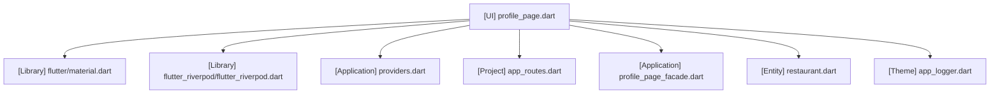

# Dependency Graph: profile_page.dart

Location: `lib/app/pages/profile_page.dart`

```mermaid
graph TD
    profile_page_dart["[UI] profile_page.dart"]
    profile_page_dart --> flutter_material_dart["[Library] flutter/material.dart"]
    profile_page_dart --> flutter_riverpod_flutter_riverpod_dart["[Library] flutter_riverpod/flutter_riverpod.dart"]
    profile_page_dart --> providers_dart["[Application] providers.dart"]
    profile_page_dart --> app_routes_dart["[Project] app_routes.dart"]
    profile_page_dart --> profile_page_facade_dart["[Application] profile_page_facade.dart"]
    profile_page_dart --> restaurant_dart["[Entity] restaurant.dart"]
    profile_page_dart --> app_logger_dart["[Theme] app_logger.dart"]
```
