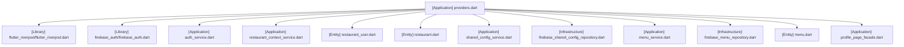

# Dependency Graph: providers.dart

Location: `lib/app/providers/providers.dart`

```mermaid
graph TD
    providers_dart["[Application] providers.dart"]
    providers_dart --> flutter_riverpod_flutter_riverpod_dart["[Library] flutter_riverpod/flutter_riverpod.dart"]
    providers_dart --> firebase_auth_firebase_auth_dart["[Library] firebase_auth/firebase_auth.dart"]
    providers_dart --> auth_service_dart["[Application] auth_service.dart"]
    providers_dart --> restaurant_context_service_dart["[Application] restaurant_context_service.dart"]
    providers_dart --> restaurant_user_dart["[Entity] restaurant_user.dart"]
    providers_dart --> restaurant_dart["[Entity] restaurant.dart"]
    providers_dart --> shared_config_service_dart["[Application] shared_config_service.dart"]
    providers_dart --> firebase_shared_config_repository_dart["[Infrastructure] firebase_shared_config_repository.dart"]
    providers_dart --> menu_service_dart["[Application] menu_service.dart"]
    providers_dart --> firebase_menu_repository_dart["[Infrastructure] firebase_menu_repository.dart"]
    providers_dart --> menu_dart["[Entity] menu.dart"]
    providers_dart --> profile_page_facade_dart["[Application] profile_page_facade.dart"]
```
