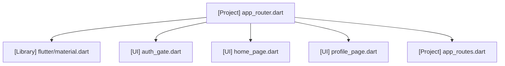

# Dependency Graph: app_router.dart

Location: `lib/app/routing/app_router.dart`

```mermaid
graph TD
    app_router_dart["[Project] app_router.dart"]
    app_router_dart --> flutter_material_dart["[Library] flutter/material.dart"]
    app_router_dart --> auth_gate_dart["[UI] auth_gate.dart"]
    app_router_dart --> home_page_dart["[UI] home_page.dart"]
    app_router_dart --> profile_page_dart["[UI] profile_page.dart"]
    app_router_dart --> app_routes_dart["[Project] app_routes.dart"]
```
