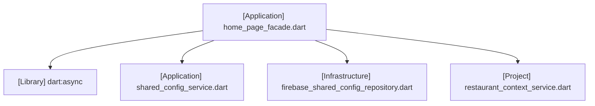

# Dependency Graph: home_page_facade.dart

Location: `lib/app/services/home_page_facade.dart`

```mermaid
graph TD
    home_page_facade_dart["[Application] home_page_facade.dart"]
    home_page_facade_dart --> dart_async["[Library] dart:async"]
    home_page_facade_dart --> shared_config_service_dart["[Application] shared_config_service.dart"]
    home_page_facade_dart --> firebase_shared_config_repository_dart["[Infrastructure] firebase_shared_config_repository.dart"]
    home_page_facade_dart --> restaurant_context_service_dart["[Project] restaurant_context_service.dart"]
```
