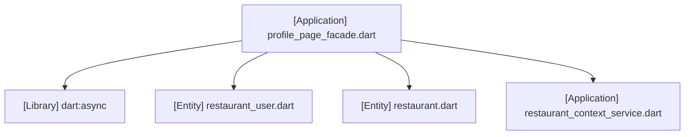

# Dependency Graph: profile_page_facade.dart

Location: `lib/app/services/profile_page_facade.dart`

```mermaid
graph TD
    profile_page_facade_dart["[Application] profile_page_facade.dart"]
    profile_page_facade_dart --> dart_async["[Library] dart:async"]
    profile_page_facade_dart --> restaurant_user_dart["[Entity] restaurant_user.dart"]
    profile_page_facade_dart --> restaurant_dart["[Entity] restaurant.dart"]
    profile_page_facade_dart --> restaurant_context_service_dart["[Application] restaurant_context_service.dart"]
```
