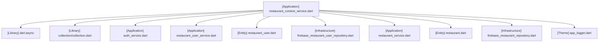

# Dependency Graph: restaurant_context_service.dart

Location: `lib/app/services/restaurant_context_service.dart`

```mermaid
graph TD
    restaurant_context_service_dart["[Application] restaurant_context_service.dart"]
    restaurant_context_service_dart --> dart_async["[Library] dart:async"]
    restaurant_context_service_dart --> collection_collection_dart["[Library] collection/collection.dart"]
    restaurant_context_service_dart --> auth_service_dart["[Application] auth_service.dart"]
    restaurant_context_service_dart --> restaurant_user_service_dart["[Application] restaurant_user_service.dart"]
    restaurant_context_service_dart --> restaurant_user_dart["[Entity] restaurant_user.dart"]
    restaurant_context_service_dart --> firebase_restaurant_user_repository_dart["[Infrastructure] firebase_restaurant_user_repository.dart"]
    restaurant_context_service_dart --> restaurant_service_dart["[Application] restaurant_service.dart"]
    restaurant_context_service_dart --> restaurant_dart["[Entity] restaurant.dart"]
    restaurant_context_service_dart --> firebase_restaurant_repository_dart["[Infrastructure] firebase_restaurant_repository.dart"]
    restaurant_context_service_dart --> app_logger_dart["[Theme] app_logger.dart"]
```
