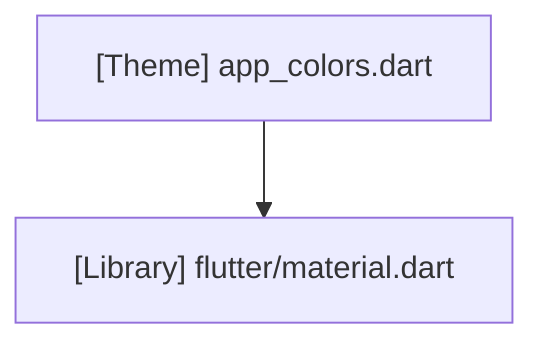

# Dependency Graph: app_colors.dart

Location: `lib/app/theme/app_colors.dart`

```mermaid
graph TD
    app_colors_dart["[Theme] app_colors.dart"]
    app_colors_dart --> flutter_material_dart["[Library] flutter/material.dart"]
```
