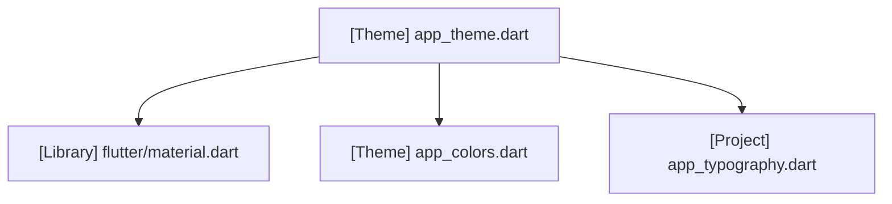

# Dependency Graph: app_theme.dart

Location: `lib/app/theme/app_theme.dart`

```mermaid
graph TD
    app_theme_dart["[Theme] app_theme.dart"]
    app_theme_dart --> flutter_material_dart["[Library] flutter/material.dart"]
    app_theme_dart --> app_colors_dart["[Theme] app_colors.dart"]
    app_theme_dart --> app_typography_dart["[Project] app_typography.dart"]
```
