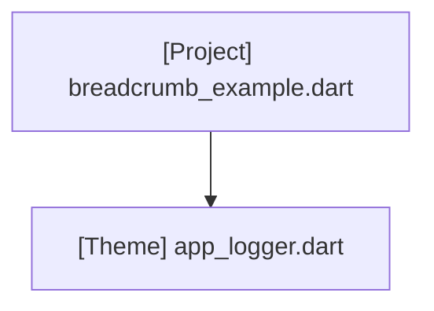

# Dependency Graph: breadcrumb_example.dart

Location: `lib/examples/breadcrumb_example.dart`

```mermaid
graph TD
    breadcrumb_example_dart["[Project] breadcrumb_example.dart"]
    breadcrumb_example_dart --> app_logger_dart["[Theme] app_logger.dart"]
```
