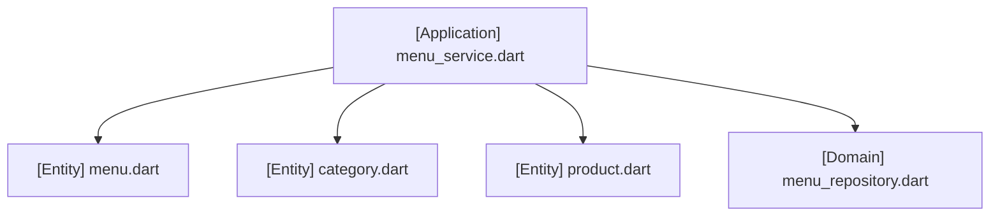

# Dependency Graph: menu_service.dart

Location: `lib/features/menu/application/services/menu_service.dart`

```mermaid
graph TD
    menu_service_dart["[Application] menu_service.dart"]
    menu_service_dart --> menu_dart["[Entity] menu.dart"]
    menu_service_dart --> category_dart["[Entity] category.dart"]
    menu_service_dart --> product_dart["[Entity] product.dart"]
    menu_service_dart --> menu_repository_dart["[Domain] menu_repository.dart"]
```
