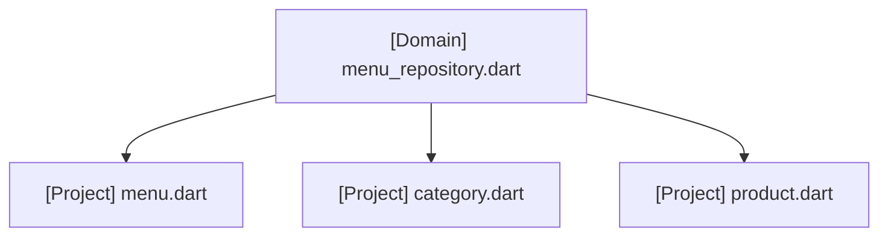

# Dependency Graph: menu_repository.dart

Location: `lib/features/menu/domain/repositories/menu_repository.dart`

```mermaid
graph TD
    menu_repository_dart["[Domain] menu_repository.dart"]
    menu_repository_dart --> menu_dart["[Project] menu.dart"]
    menu_repository_dart --> category_dart["[Project] category.dart"]
    menu_repository_dart --> product_dart["[Project] product.dart"]
```
