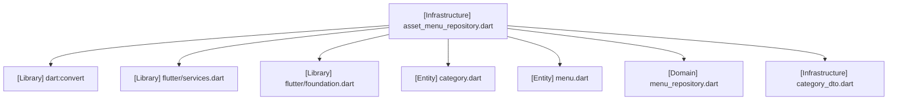

# Dependency Graph: asset_menu_repository.dart

Location: `lib/features/menu/infrastructure/repositories/asset_menu_repository.dart`

```mermaid
graph TD
    asset_menu_repository_dart["[Infrastructure] asset_menu_repository.dart"]
    asset_menu_repository_dart --> dart_convert["[Library] dart:convert"]
    asset_menu_repository_dart --> flutter_services_dart["[Library] flutter/services.dart"]
    asset_menu_repository_dart --> flutter_foundation_dart["[Library] flutter/foundation.dart"]
    asset_menu_repository_dart --> category_dart["[Entity] category.dart"]
    asset_menu_repository_dart --> menu_dart["[Entity] menu.dart"]
    asset_menu_repository_dart --> menu_repository_dart["[Domain] menu_repository.dart"]
    asset_menu_repository_dart --> category_dto_dart["[Infrastructure] category_dto.dart"]
```
