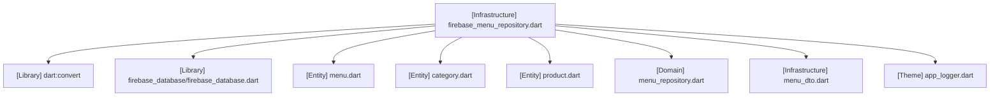

# Dependency Graph: firebase_menu_repository.dart

Location: `lib/features/menu/infrastructure/repositories/firebase_menu_repository.dart`

```mermaid
graph TD
    firebase_menu_repository_dart["[Infrastructure] firebase_menu_repository.dart"]
    firebase_menu_repository_dart --> dart_convert["[Library] dart:convert"]
    firebase_menu_repository_dart --> firebase_database_firebase_database_dart["[Library] firebase_database/firebase_database.dart"]
    firebase_menu_repository_dart --> menu_dart["[Entity] menu.dart"]
    firebase_menu_repository_dart --> category_dart["[Entity] category.dart"]
    firebase_menu_repository_dart --> product_dart["[Entity] product.dart"]
    firebase_menu_repository_dart --> menu_repository_dart["[Domain] menu_repository.dart"]
    firebase_menu_repository_dart --> menu_dto_dart["[Infrastructure] menu_dto.dart"]
    firebase_menu_repository_dart --> app_logger_dart["[Theme] app_logger.dart"]
```
