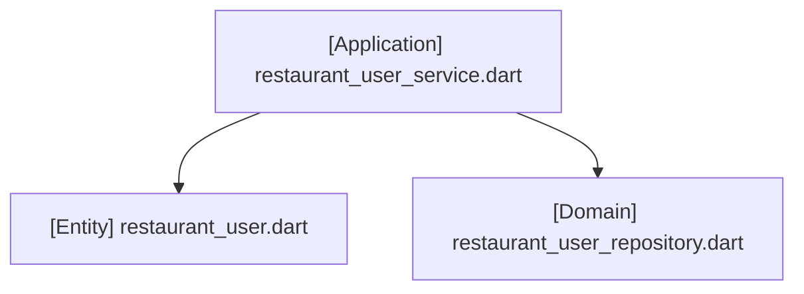

# Dependency Graph: restaurant_user_service.dart

Location: `lib/features/restaurant-user-feature/application/restaurant_user_service.dart`

```mermaid
graph TD
    restaurant_user_service_dart["[Application] restaurant_user_service.dart"]
    restaurant_user_service_dart --> restaurant_user_dart["[Entity] restaurant_user.dart"]
    restaurant_user_service_dart --> restaurant_user_repository_dart["[Domain] restaurant_user_repository.dart"]
```
