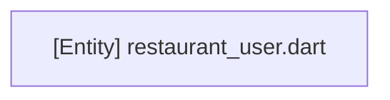

# Dependency Graph: restaurant_user.dart

Location: `lib/features/restaurant-user-feature/domain/entities/restaurant_user.dart`

```mermaid
graph TD
    restaurant_user_dart["[Entity] restaurant_user.dart"]
```
