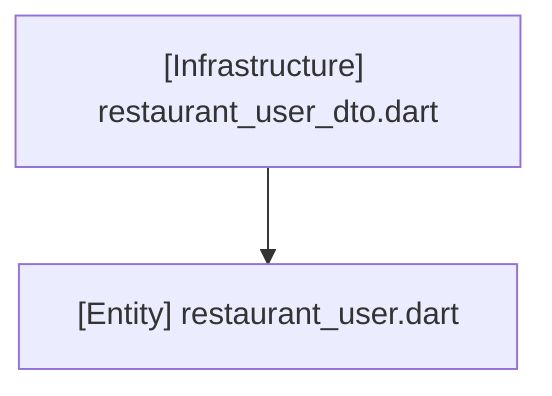

# Dependency Graph: restaurant_user_dto.dart

Location: `lib/features/restaurant-user-feature/infrastructure/dtos/restaurant_user_dto.dart`

```mermaid
graph TD
    restaurant_user_dto_dart["[Infrastructure] restaurant_user_dto.dart"]
    restaurant_user_dto_dart --> restaurant_user_dart["[Entity] restaurant_user.dart"]
```
