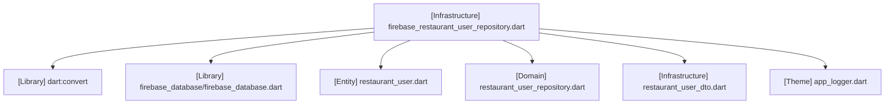

# Dependency Graph: firebase_restaurant_user_repository.dart

Location: `lib/features/restaurant-user-feature/infrastructure/repositories/firebase_restaurant_user_repository.dart`

```mermaid
graph TD
    firebase_restaurant_user_repository_dart["[Infrastructure] firebase_restaurant_user_repository.dart"]
    firebase_restaurant_user_repository_dart --> dart_convert["[Library] dart:convert"]
    firebase_restaurant_user_repository_dart --> firebase_database_firebase_database_dart["[Library] firebase_database/firebase_database.dart"]
    firebase_restaurant_user_repository_dart --> restaurant_user_dart["[Entity] restaurant_user.dart"]
    firebase_restaurant_user_repository_dart --> restaurant_user_repository_dart["[Domain] restaurant_user_repository.dart"]
    firebase_restaurant_user_repository_dart --> restaurant_user_dto_dart["[Infrastructure] restaurant_user_dto.dart"]
    firebase_restaurant_user_repository_dart --> app_logger_dart["[Theme] app_logger.dart"]
```
