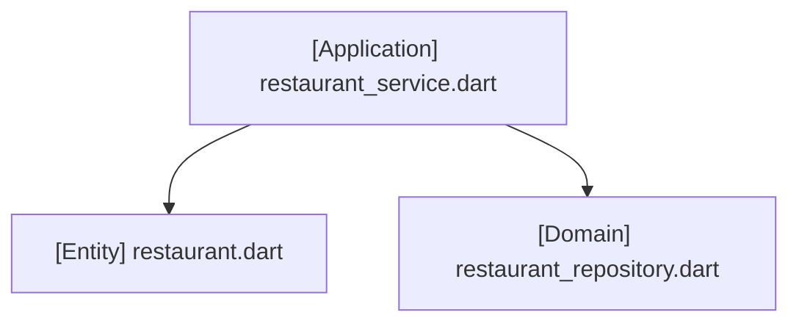

# Dependency Graph: restaurant_service.dart

Location: `lib/features/restaurant/application/restaurant_service.dart`

```mermaid
graph TD
    restaurant_service_dart["[Application] restaurant_service.dart"]
    restaurant_service_dart --> restaurant_dart["[Entity] restaurant.dart"]
    restaurant_service_dart --> restaurant_repository_dart["[Domain] restaurant_repository.dart"]
```
