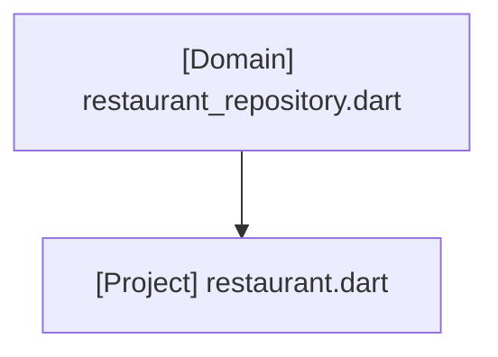

# Dependency Graph: restaurant_repository.dart

Location: `lib/features/restaurant/domain/repositories/restaurant_repository.dart`

```mermaid
graph TD
    restaurant_repository_dart["[Domain] restaurant_repository.dart"]
    restaurant_repository_dart --> restaurant_dart["[Project] restaurant.dart"]
```
