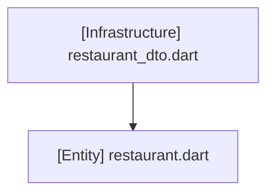

# Dependency Graph: restaurant_dto.dart

Location: `lib/features/restaurant/infrastructure/dtos/restaurant_dto.dart`

```mermaid
graph TD
    restaurant_dto_dart["[Infrastructure] restaurant_dto.dart"]
    restaurant_dto_dart --> restaurant_dart["[Entity] restaurant.dart"]
```
