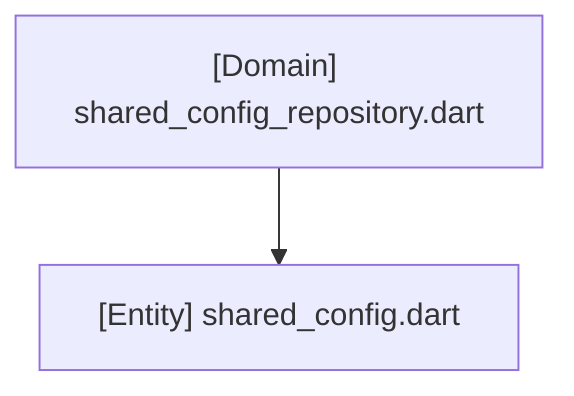

# Dependency Graph: shared_config_repository.dart

Location: `lib/features/shared-config-feature/domain/repositories/shared_config_repository.dart`

```mermaid
graph TD
    shared_config_repository_dart["[Domain] shared_config_repository.dart"]
    shared_config_repository_dart --> shared_config_dart["[Entity] shared_config.dart"]
```
