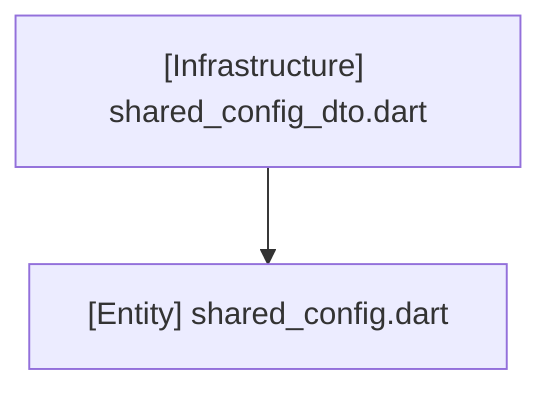

# Dependency Graph: shared_config_dto.dart

Location: `lib/features/shared-config-feature/infrastructure/dtos/shared_config_dto.dart`

```mermaid
graph TD
    shared_config_dto_dart["[Infrastructure] shared_config_dto.dart"]
    shared_config_dto_dart --> shared_config_dart["[Entity] shared_config.dart"]
```
