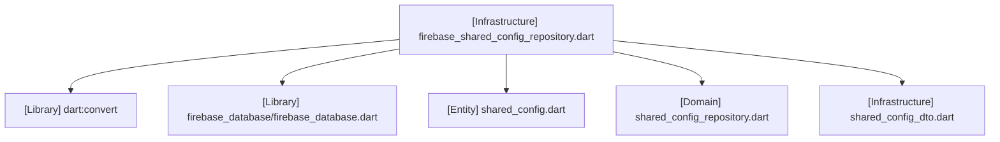

# Dependency Graph: firebase_shared_config_repository.dart

Location: `lib/features/shared-config-feature/infrastructure/repositories/firebase_shared_config_repository.dart`

```mermaid
graph TD
    firebase_shared_config_repository_dart["[Infrastructure] firebase_shared_config_repository.dart"]
    firebase_shared_config_repository_dart --> dart_convert["[Library] dart:convert"]
    firebase_shared_config_repository_dart --> firebase_database_firebase_database_dart["[Library] firebase_database/firebase_database.dart"]
    firebase_shared_config_repository_dart --> shared_config_dart["[Entity] shared_config.dart"]
    firebase_shared_config_repository_dart --> shared_config_repository_dart["[Domain] shared_config_repository.dart"]
    firebase_shared_config_repository_dart --> shared_config_dto_dart["[Infrastructure] shared_config_dto.dart"]
```
