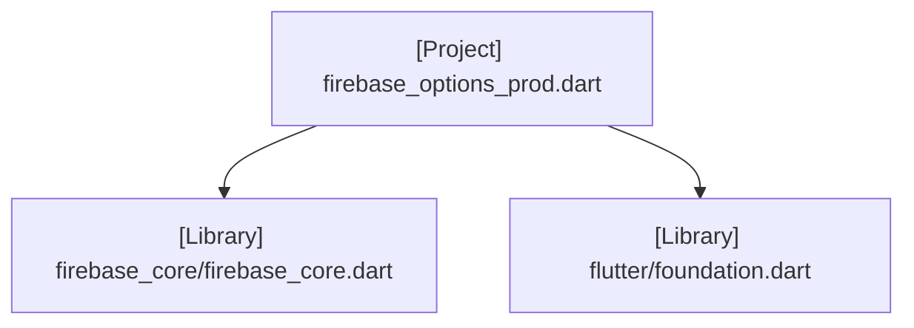

# Dependency Graph: firebase_options_prod.dart

Location: `lib/firebase_options_prod.dart`

```mermaid
graph TD
    firebase_options_prod_dart["[Project] firebase_options_prod.dart"]
    firebase_options_prod_dart --> firebase_core_firebase_core_dart["[Library] firebase_core/firebase_core.dart"]
    firebase_options_prod_dart --> flutter_foundation_dart["[Library] flutter/foundation.dart"]
```
