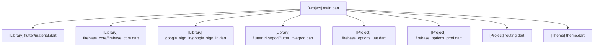

# Dependency Graph: main.dart

Location: `lib/main.dart`

```mermaid
graph TD
    main_dart["[Project] main.dart"]
    main_dart --> flutter_material_dart["[Library] flutter/material.dart"]
    main_dart --> firebase_core_firebase_core_dart["[Library] firebase_core/firebase_core.dart"]
    main_dart --> google_sign_in_google_sign_in_dart["[Library] google_sign_in/google_sign_in.dart"]
    main_dart --> flutter_riverpod_flutter_riverpod_dart["[Library] flutter_riverpod/flutter_riverpod.dart"]
    main_dart --> firebase_options_uat_dart["[Project] firebase_options_uat.dart"]
    main_dart --> firebase_options_prod_dart["[Project] firebase_options_prod.dart"]
    main_dart --> routing_dart["[Project] routing.dart"]
    main_dart --> theme_dart["[Theme] theme.dart"]
```
