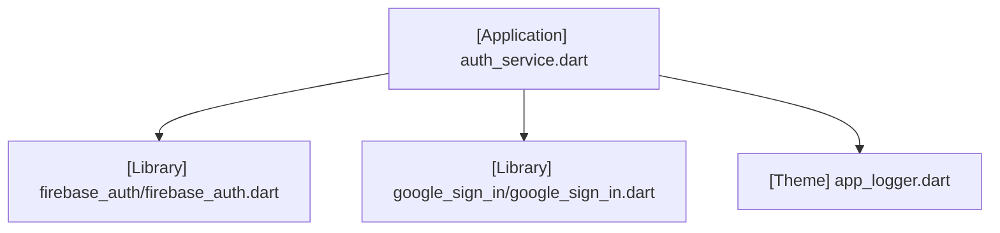

# Dependency Graph: auth_service.dart

Location: `lib/services/auth_service.dart`

```mermaid
graph TD
    auth_service_dart["[Application] auth_service.dart"]
    auth_service_dart --> firebase_auth_firebase_auth_dart["[Library] firebase_auth/firebase_auth.dart"]
    auth_service_dart --> google_sign_in_google_sign_in_dart["[Library] google_sign_in/google_sign_in.dart"]
    auth_service_dart --> app_logger_dart["[Theme] app_logger.dart"]
```
