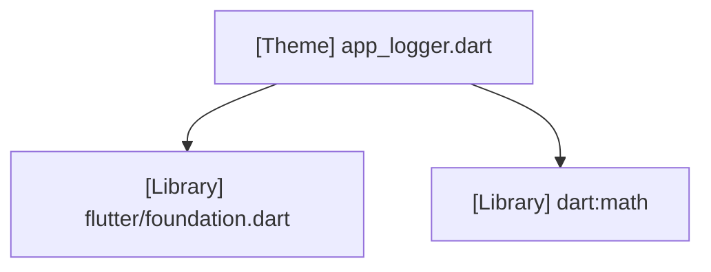

# Dependency Graph: app_logger.dart

Location: `lib/utils/app_logger.dart`

```mermaid
graph TD
    app_logger_dart["[Theme] app_logger.dart"]
    app_logger_dart --> flutter_foundation_dart["[Library] flutter/foundation.dart"]
    app_logger_dart --> dart_math["[Library] dart:math"]
```
